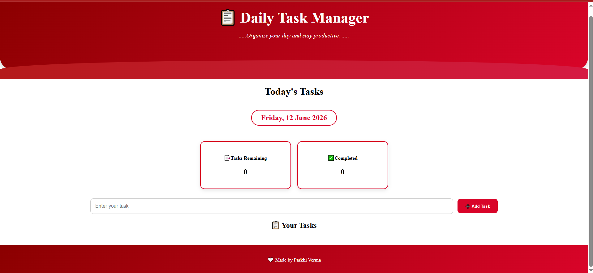
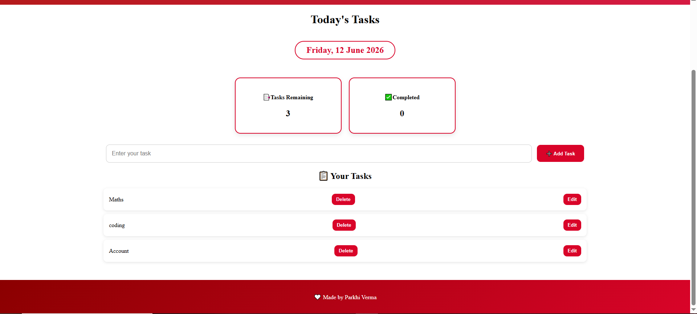

# 📋 Daily Task Manager

A simple and beautiful To-Do List web application that helps users organize their daily tasks and stay productive.

## ✨ Features

- Add tasks
- Mark tasks as completed
- Delete tasks
- Simple and attractive interface
- Easy to use

## 🛠️ Technologies Used

- HTML5
- CSS3
- JavaScript

## 📸 Screenshots

### Home Screen

### Task Management

## 🚀 How to Run

1. Download or clone the repository.
2. Open `index.html` in your web browser.
3. Start managing your daily tasks.

## 📁 Files

- `index.html` – Structure of the application
- `simple_to_do_list.css` – Styling and design
- `js_to_do_list.js` – Functionality and task management logic

## 🎯 Learning Objectives

This project was built to practice:

- HTML fundamentals
- CSS styling
- JavaScript DOM manipulation
- Git and GitHub

## 👨‍💻 Author

Parkhi Verma

## ⭐ Project Status

Completed as a learning project and uploaded to GitHub.

## 📄 License

This project is available for learning and educational purposes.
